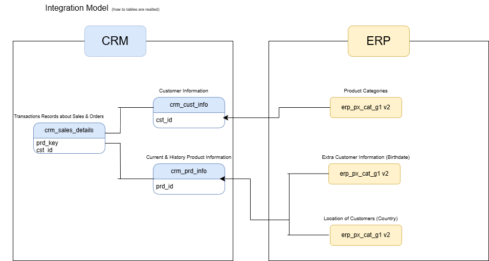
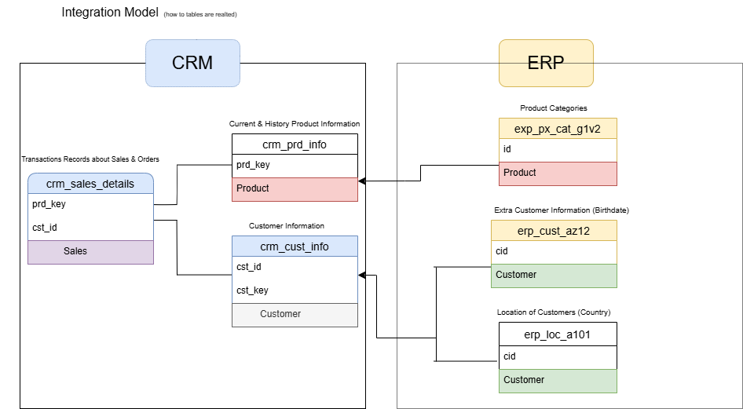

# Sales Data Warehouse (SQL Server)

## 📌 Project Overview
This project demonstrates an end-to-end Sales Data Warehouse built using SQL Server following the Medallion Architecture (Bronze, Silver, Gold layers).

The system integrates CRM and ERP data sources and transforms them into analytical-ready star schema tables.

---

## 🏗 Architecture

### 1️⃣ Integration Model

### 2️⃣ CRM & ERP Mapping

### 3️⃣ Medallion Architecture

### 4️⃣ Gold Layer Star Schema

---

## 🥉 Bronze Layer
- Raw data ingestion
- CRM & ERP source tables
- Minimal transformations

## 🥈 Silver Layer
- Data cleaning
- Standardization
- Data transformations

## 🥇 Gold Layer
- Fact & Dimension tables
- Business-ready analytical model
- Star schema design

---

## 🛠 Technologies Used
- SQL Server
- T-SQL
- Data Warehousing Concepts
- Medallion Architecture
- Star Schema Modeling

---

## 📊 Key Features
- End-to-end ETL flow
- CRM + ERP data integration
- Dimensional modeling
- Fact & Dimension design
- Sales calculation logic (Quantity × Price)

---

## 👩‍💻 Author
Chittimireddy Navyasree
